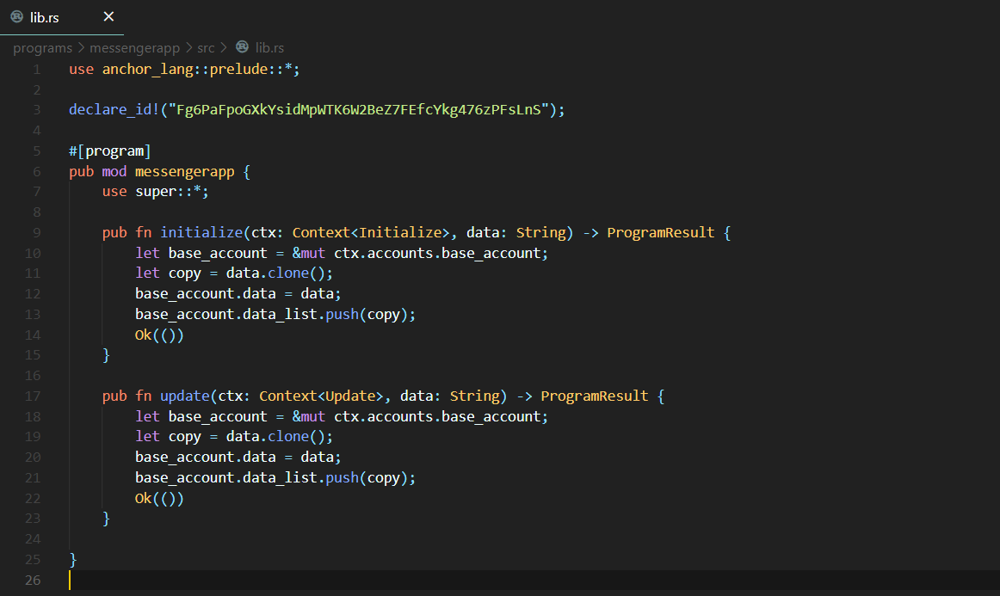
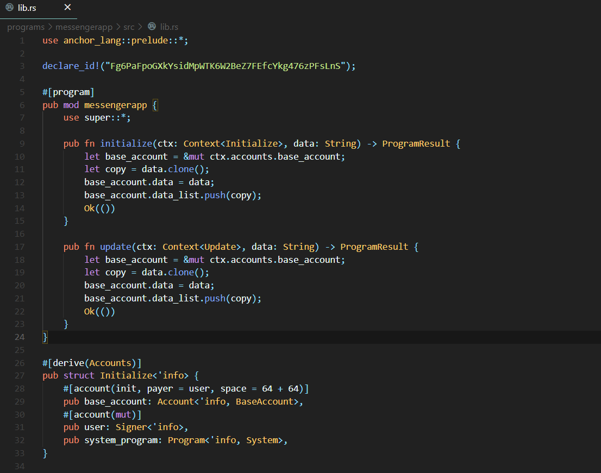
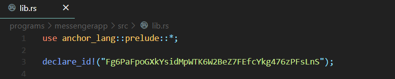
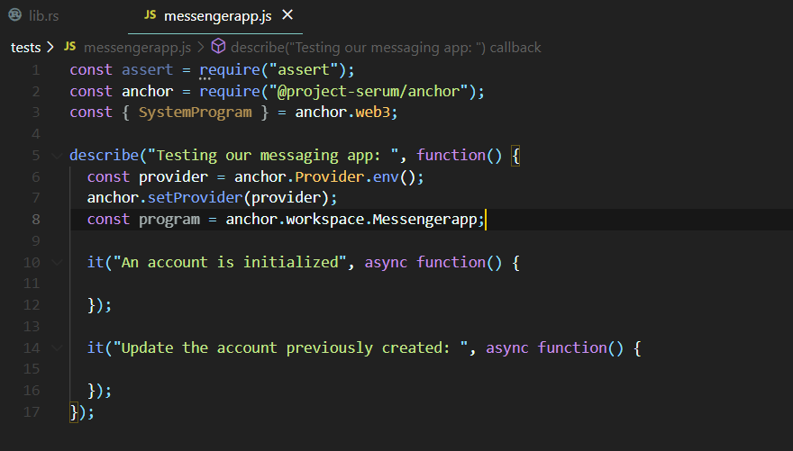
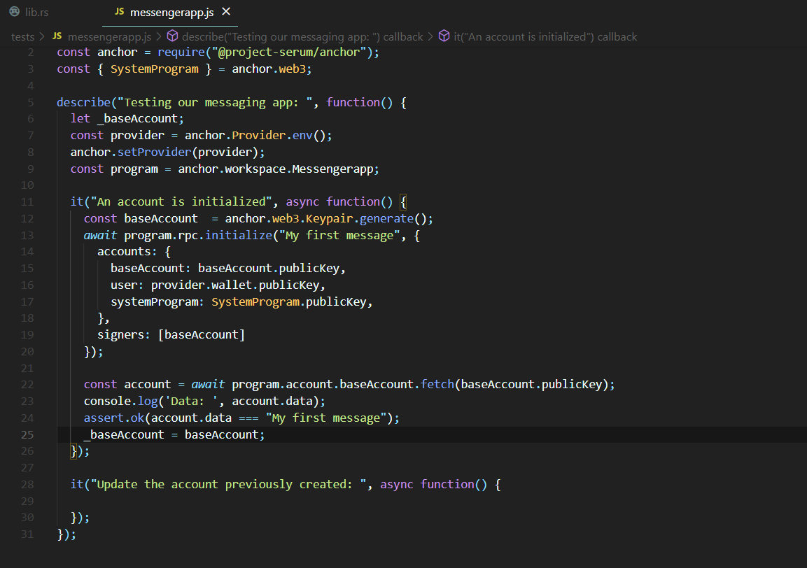
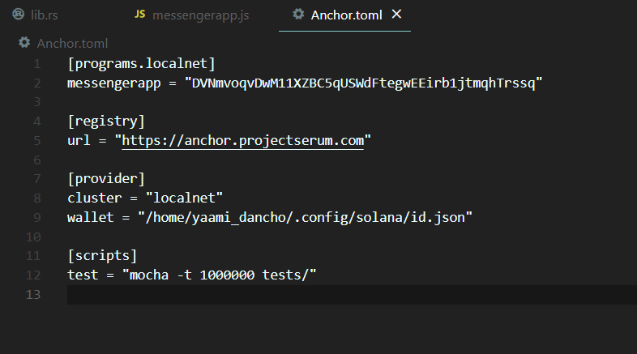
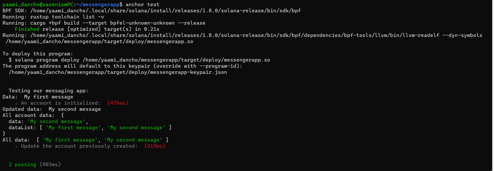

# Building a messaging app on Solana: Starting with a blockchain time capsule

Welcome to the Solana messaging app quest. With this quest you'll get upto speed with the most rapidly rising blockchain in the market: *Solana*. It would be awesome if you know a bit 
of Rust or C++ already and are familiar with how blockchains work, but even if you do not have any specific background of Rust or Solana development, we will have all bases covered. If 
you have a high level of interest and motivation, we should be good to go ahead.

In this quest, we will be developing a blockchain based time-capsule. This essentially means that you'll be able to leave a message on the Solana blockchain and anyone can view it for as
long as the Solana blockchain itself exists. Your message will survive the test of time and could not be taken down by anyone. 

This time-capsule quest will set us up for extending this project and creating an entire messaging app. How cool is that, right?

# Setting up the Environment: 

There are a few things that we need to get up and running before we move forward in this quest. Before we move forward make sure you've a working NodeJS environment set up. We need rust, Solana, Mocha(a JS testing framework), Anchor and Phantom wallet for this quest.
To install rust, run
```
curl --proto '=https' --tlsv1.2 -sSf https://sh.rustup.rs | sh
source $HOME/.cargo/env
rustup component add rustfmt
```

To install Solana, run
```
sh -c "$(curl -sSfL https://release.solana.com/v1.8.0/install)"
```

To install mocha globally, run
```
npm install -g mocha
```

Now we'll be installing Anchor.
If you're on a linux system, run
```
# Only on linux systems
npm i -g @project-serum/anchor-cli
```

**Fair Warning** : If you are using a Windows system, we highly suggest using [WSL2](https://en.wikipedia.org/wiki/Windows_Subsystem_for_Linux) (Windows sub-system for Linux) or switching to a Linux environment. Setting up WSL is also quick and easy. A 
good walk-through can be found [here](https://www.youtube.com/watch?v=X3bPWl9Z2D0&ab_channel=BeachcastsProgrammingVideos)
For any other OS, you need to build from source. Run the following command
```
cargo install --git https://github.com/project-serum/anchor --tag v0.18.0 anchor-cli --locked
```

To verify that Anchor is installed, run
```
anchor --version
```

Since Solana is still a pretty new blockchain compared to the establised ones out there, it's developer tooling too is pretty limited and cumbersome as of now. However, it is rapidly improving 
and it does so on a daily basis. At the forefront of this development is Anchor, by [Armani Ferrante](https://twitter.com/armaniferrante). You can think of it like the Ruby on Rails framework for
Ruby, that means yes, you can develop things on vanilla Ruby, but Ruby on Rails makes your life much much easier, right? That's the same with Anchor and Solana development. Anchor is the Hardhat of 
Solana development plus much more. It offers a Rust DSL (basically, an easier Rust) to work with along with IDL, CLI and workspace management. 


# Running configurations on Solana CLI

The first command you should run on your terminal (assuming Solana CLI was properly installed in the last quest) is:

```
solana config get
```

This should throw up a result similar to something like: 


If you didnot set up your keypair earlier, then you won't be having the `Keypair Path` in your results. To set that up, follow the instructions over [here](https://docs.solana.com/wallet-guide/paper-wallet#seed-phrase-generation)

We would want to remain on the local network for building our program and later shift to the devent or mainnet-beta if required. If the `RPC URL` field of your last result did not show `localhost`, you can set it to localhost using the following command:

```
solana config set --url localhost
```

Next, we would want to know our account/wallet address and airdrop some SOL tokens into it, to handle all the deployment, transactions etc costs that come with interacting with and using a Solana program. To do that first let's find our address. The command to do that is:
```
solana address
```

This would result into something like this:


Then, for more comprehensive details of your account, use the following command with the address that you got from the last command
```
solana account <your address from the last command>
```

This would result into something like this:


Next, we want to spin up our local network. Think of this local network as a mock Solana blockchain running on your own single system. This network would be required for development and testing of our program. To spin it up, in a separate tab, use the following command:
```
solana-test-validator
```

Once you get an image, like the one below, you know that your local validator (local network) is now up and running


Now, our last task is to top up our account with some SOL, which you can do by using:

```
solana airdrop 100
```

This should result in something like:


# Setting up our Anchor project

In this sub-quest all we would do is initialize an Anchor project and see whether everything's there and working fine or not and after move on ahead to make our own changes.
Head over to your preferred destination for the project using your terminal and then type the following command:
```
anchor init messengerapp

cd messengerapp
``` 

This would result in a screen somewhat similar to this:


First we check whether we can see the *programs*, *app*, *programs*, *migrations* directory among others or not. If we can, we would head over to *programs/messengerapp/src/lib.rs* to see the default program that Anchor provides us. This is the most basic example possible on Anchor and what's happening here is simply that a user-defined function `Initialize` whenever called would successfully exit the program. That's all, nothing fancy. Now, let's try to compile this program using the following command:

```
anchor build
```

This would trigger a build function and would something like this upon completion:


This build creates a new folder in your project directory called, `target`. This `target` folder contains the `idl` directory, which would also contain the `idl` for our program. The `IDL` or Interface Description Language describes the instructions exposed by the contract and is very similar to ABI in Solidity and user for similar purposes, ie, for tests and front-end integrations. Next, we can move onto testing this program, so that we can get familiar with how testing is done in Anchor. Head to `tests/messengerapp.js`. Here, you'll see a test written in javascript to interact and test the default program. There are a lot of things in the test, that may not make sense to you right now, but stick around and we'll get to those shortly. The test would look something like this:


Next, to actually run these tests, first head over to the tab where you ran the solana-test-validator command and kill that process (using Ctrl-C). Now, use the following command:

```
anchor test
```

The passing tests should result in the following screen:


Now, let's head over to the `programs` directory again and start making changes to create our messaging app.

## Writing our first program function

Head over to `programs/messengerapp/src/lib.rs` and clear the code written there apart from the macro declarations and crates (libraries) that we will be using. After the clearning, your coding screen should look somehting like this:


Now let us simply define two functions that we will be using in our Solana program. The bulk of the program goes in a module under the `#[program]` macro. We'll just define them under the `pub mod messengerapp` and write the logic later. These two function definitions would look like this:
```
    pub fn initialize(ctx: Context<Initialize>, data: String) -> ProgramResult {
        
    }

    pub fn update(ctx: Context<Update>, data: String) -> ProgramResult {
        
    }
```
Here `pub` means public and `fn` means function, implying that they are public functions that can be invoked from our program, ie it becomes a client-callable program function. The first argument of these functions is always `Context<T>` which consist of the solana accounts array and the program ID, which in essence is the required data to call just about any progarm on Solana. The next parameter of both these functions is a `String` named data, which we will be using as our message. The `ProgramResult` is the return type of both these functions, which actually is just an easier method to serve function results and/or errors.

After defining the above two functions, your code should look something like this:


Now, let's write our logic for the `initialize` function, ok? Let's first make our intentions clear for this function and the program in general. We want to keep track of two things here. First, is the data that is being passed while calling the function and the second is the list of all the data(messages) that have been passed to our specific account. So, we would want our main account (the account that will handle all the messaging stuff of the program) to have two fields, one for storing the incoming data and the other for keeping a record of all earlier data. We call this account the `base_account`. Also, keep in mind that since we will be adding to the data_list everytime a new data is introduced, we will need the account to be mutable, ie, the account should be able to accept changes. Write the following logic inside the `initialize` function now:

```
let base_account = &mut ctx.accounts.base_account;
let copy = data.clone();
base_account.data = data;
base_account.data_list.push(copy);
Ok(())
```
The `Ok(())` syntax is used for error handling of the ProgramResult type. You can think of `Ok(())` like a gate, that lets the program continue if there are no errors but sends the program into another state if an error is encountered.  

Now, your coding screen should look something like this: 


## A small note about Accounts on Solana:
An account is not actually a wallet. Instead, it’s a way for the contract to persist data between calls. This includes information such as the count in our base_account, and also information about permissions on the account. Accounts pay rent in the form of lamports, and if it runs out, then the account is purged from the blockchain. Accounts with two years worth of rent attached are “rent-exempt” and can stay on the chain forever.

# Writing out our second function

In the last sub-quest we defined the `update` function, right? Now let's go ahead and write the logic for this function. 

```
let base_account = &mut ctx.accounts.base_account;
let copy = data.clone();
base_account.data = data;
base_account.data_list.push(copy);
Ok(())
```

Your code screen should now look like this:


Wasn't this funny? We wrote the same code again, right? Well, yes, the logic of both the functions were same and the only real difference is in the `Account` inside of the `Context<>` struct. This is a simple container for the currently executing `program_id` generic over `Accounts`. This essentially is what would differentiate between whether the message coming in our program is the first message or some later messages. Now, the natural question would be where are all these `structs` defined? Calm down, champ. We haven't yet defined them, but that is exactly what we will be doing next.

# Defining the first Account struct used in our program

Let's first define the `Initialize` struct used in our `initialize` function that we defined two sub-quests back. We already have gone over what `Accounts` and `Context` are. So, here just keep in mind that whenever we need to include multiple `accounts` in a struct, we would use the derive Accounts macro, which is `#[derive(Accounts)]`, basically when we want to *derive* an account to pass to the function using other `accounts`, we use the derive accounts macro and while defining a singular `account` we would simply use the normal account macro, which is `[account]`. Now the normal account marco can also consist of many parameters which denote the permissions related to that particular account and we will look into those as we move ahead. Write the following code into your editor:

```
#[derive(Accounts)]
pub struct Initialize<'info> {
    #[account(init, payer = user, space = 64 + 64)]
    pub base_account: Account<'info, BaseAccount>,
    #[account(mut)]
    pub user: Signer<'info>,
    pub system_program: Program<'info, System>,
}
```

As discussed earlier, we used the derive Accounts macro since we had to incorporate 3 accounts here and for all these three accounts individually, we used the account macro. Now onto the arguments used with these macros. The `init` macro is used to create a new account owned by the current program which is our `messengerapp` program. Whenever `init` parameter is used, we must always specify the `payer` or the account that will be paying for creation of the account on the Solana blockchain, along with the `space` param which is the space with which the new account is created.

The `mut` parameter marks an account as mutable, which essentially means our account will be altered and Solana will need to update the data in your account. So, always use the `mut` parameter for persisting changes. 

Another new concept used here is the `Signer` type. This is used to enforce the constraint that the `authority` account (messengerapp in this case) *signed* the transaction. 

The peculiar thing you might notice here is that the `base_account` field is of type `BaseAccount`, but that `BaseAccount` is not to be found anywhere, right? As always, we will be defining that in just the next sub-quest. So hold on and re-read all the info that you just recieved if you feel the need. In the next sub-quest we will be defining the `Update` and `BaseAccount` structs.

Your coding screen should look like this right now:



## Further Reading:
You can read up on different types of account constraints [here](https://docs.rs/anchor-lang/0.18.0/anchor_lang/derive.Accounts.html).

# Defining all remaining Accounts of our program

With the understanding about all kinds of `Account` marcos and the associated parameters with them, let's get straight into writing the other two account structs.

```
pub struct Update<'info> {
    #[account(mut)]
    pub base_account: Account<'info, BaseAccount>,
```

and now the final `BaseAccount` struct:

```
#[account]
pub struct BaseAccount {
    pub data: String,
    pub data_list: Vec<String>,
```

Now, for the `Update` account struct, we notice that it is essentially the same as the `Initialize` account struct, it's just that we are using an existing field `base_account` of type `BaseAccount` and not creating it. After which, we define the `BaseAccount` that was being used everywhere. As discussed earlier, it has two fields, one is `data` of type `String` to store the incoming value of the message while the other is a `vector of strings` to store/persist all the messages in that account. A vector is a list of elements with no specified size. But, bear in mind that initially we had createed our base account with the space of `64 + 64` so there will be a limit to thow many messages can be stored. You can explore the limits at different sizes as a side quest.

After writing these definitions, your code screen should be looking something like this:


Good, now we are just one step away from being completely done with the smart contract (programs in Solana lingo) side of our project.

# Updating our program_id

Remember the `declare_id!` macro of our program that was declared at the top with a random looking string, that we did not talk about? It is time to fix that. Currently, it looks something like this:



Since, we already discussed that we would be working on our local network, we need to deploy our program on our local network and then put the `program_id` recieved from there here at this macro. First make sure that your local validator is running in a different tab. If it is not, run it again in a different tab using the `solana-test-validator` command. Now use the following command to deploy your anchor program:

```
anchor deploy
```

The above command should result in a screen similar to this:


Now, copy the **program ID** from the above output to the `declare_id` macro in our program. Something like this:


Congratulations, we are now done with writing the programs of our project. You just completed the smart contract (programs in Solana lingo) side of the Time Capsule project :D

# Creating the testing skeleton of our program

Head over to `tests/messengerapp.js` and delete everything that's written there. We are going to be writing our tests from scratch. The first step would be to import the necessary libraries and constants. To do that, use the following code:

```
const assert = require('assert');
const anchor = require('@project-serum/anchor');
const { SystemProgram } = anchor.web3;
```

Now, since we will be using `Mocha` for testing our programs, we will create the skeleton of where we will be putting our tests. So, basically, how Mocha works is that it takes `describe` blocks as testing blocks and within those `describe` blocks there are numerous tests written using the `it` blocks. So, use the following code to create the skeleton:

```
describe("Testing our messaging app: ", function() {
  const provider = anchor.Provider.env();
  anchor.setProvider(provider);
  const program = anchor.workspace.Messengerapp;

  it("An account is initialized", async function() {

  });

  it("Update the account previously created: ", async function() {

  });
});
```

Now, your code screen should look something like:



The additional things that we coded there were the introduction of `provider`. The `provider` is the abstraction of a connection to the Solana network. In the test, the Anchor framework will create the provider for us based on the environment `(anchor.Provider.env())`.

Now, the `program` is an abstraction that combines the Provider, idl, and the programID (which is generated when the program is built) and allows us to call RPC methods against our program.

When we have these two things, we can start calling functions in our program, which is what we will be doing in our next sub-quest.

# Writing our first test

The method to call the functions of our program is pretty straight-forward. We will use the program RPCs (Remote procedure calls) to access the function and then we will use the `web3.js` library to create `accounts` which have to be passed as the parameters to those functions. Let's first jump into the code of our first test and see things in action.

```
  it("An account is initialized", async function() {
    const baseAccount  = anchor.web3.Keypair.generate();
    await program.rpc.initialize("My first message", {
      accounts: {
        baseAccount: baseAccount.publicKey,
        user: provider.wallet.publicKey,
        systemProgram: SystemProgram.publicKey,
      },
      signers: [baseAccount]
    });
  });
```

Now, what we have done in the code above is simply create a `baseAccount` by generating a new account using the `web3` library. Then using the program RPC, we have called the `initialize` function and to that function we have supplied the required parameters, which were the `baseAccount`, `user`, `systemProgram` and the `signer`.

After this function is run, we simply need to grab hold of the baseAccount and check it's `data` field and verify whether it has changed to `My first message` or not. To do that, we use the following lines of code:

```
    const account = await program.account.baseAccount.fetch(baseAccount.publicKey);
    console.log('Data: ', account.data);
    assert.ok(account.data === "My first message");
    _baseAccount = baseAccount;
```

After this, your coding screen should look like this:



What we did here `fetch` the `baseAccount` from the program after the `initialize` function has been run and store it in a variable called `account`. Then we check whether the `data` field of `account` is the same as our message or not. In the last step, we save the state of this `baseAccount` in a variable called `_baseAccount`, so that we can check that later in the other tests.

Now let us write the second test, where we update the previously created `baseAccount` which we stored in `_baseAccount` and check whether new messages get stored in the `data_list` field or not.

## Writing the second test

As mentioned in the last quest, our objective with this test is to update the `data_list` field of the `baseAccount` and then verify this updation. To do that, we will write the below code:

```
    const baseAccount = _baseAccount;

    await program.rpc.update("My second message", {
      accounts: {
        baseAccount: baseAccount.publicKey,
      },
    });
```

With the above code, we assigned the `_baseAccount` to a new `baseAccount`. This step can be skipped. After that, just like how we called the `initialize` function earlier, we called the `update` function and provided it with the required params, which are the new message and the `baseAccount`. After that to verify whether the update took place or not, we will use the following code:

```
    const account = await program.account.baseAccount.fetch(baseAccount.publicKey);
    console.log("Updated data: ", account.data);
    assert.ok(account.data === "My second message");
    console.log("All account data: ", account);
    console.log("All data: ", account.dataList);
    assert.ok(account.dataList.length === 2);
```

With this, your coding screen should look something like this:


The `console.logs` can be skipped, but they are there for our own better understanding. So, in this block of code, we again fetch the `baseAccount` after the `update` function and check whether the `data` of the account has been updated or not. Then we print the details of the account itself, then the entire list of all the messages and finally we check whether the length of this `data_list` field of the `baseAccount` is 2 or not (since it should ideally contain [*My first message*, *My second message*]).

With this we are done writing our tests, now all that remains is to actually run these tests.

# Testing our program

Remember, some time back we changed the `program_id` in the `declare_id` macro of our program? We will follow a similar step in the `Anchor.toml` file now. Open the `Anchor.toml` file and replace the old `program_id` with the new `program_id`, like so:



Now, it's the moment of truth. Head over to the console and type the following command if you have not stopped the `solana-test-validator` running in a different tab:

```
anchor test --skip-local-validator
```

This will hopefully give a result similar to this:


And if this didn't work for you go to your local validator tab and close it using `Ctrl` + `C` and after come back to the tab where you were testing and type the following command:

```
anchor test
```

This should yield a result similar to:



# Congratulations

Congratulations on not only building the building blocks of a chat application on Solana, which you can use as time-capsule on the blockchain, but also successfully testing that. In the next quest, we can go on ahead to see how to connect the front-end of a website with our program and see for ourselves how well our program is working. See you all soon :)
